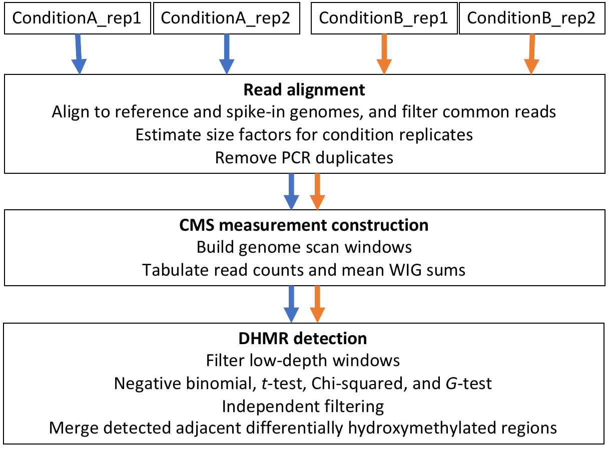

# CMSIP: Hydroxymethylation anlaysis of CMS-IP data

A scalable, accurate, and efficient solution for hydroxymethylation analysis of CMS-IP sequencing data.

Source URL: [https://github.com/lijinbio/cmsip](https://github.com/lijinbio/cmsip)



## Installation

CMSIP has been deployed in Bioconda at https://anaconda.org/bioconda/cmsip. It is encouraged to install CMSIP from Bioconda, and the following channels should be added. Namely,

```
conda config --add channels defaults
conda config --add channels bioconda
conda config --add channels conda-forge
conda install cmsip
```

## Example configuration file

An example configuration is [`cms.yaml`](https://github.com/lijinbio/cmsip/blob/master/cms.yaml) under the root of this repository.


